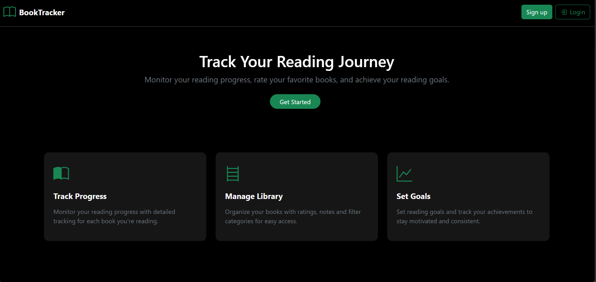
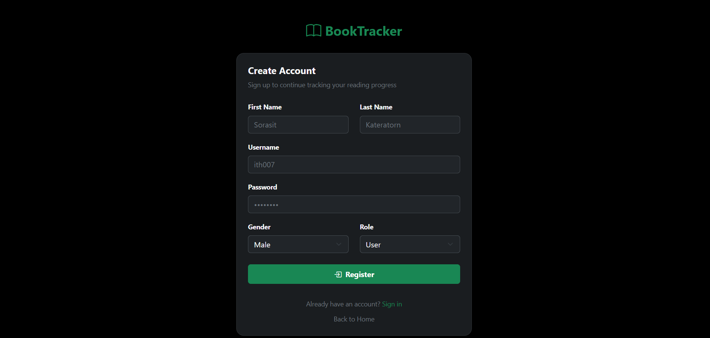
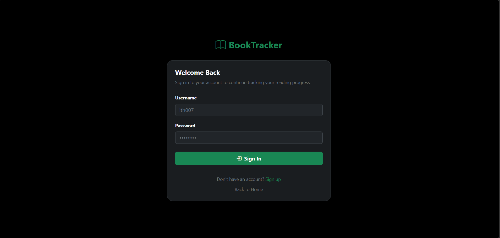
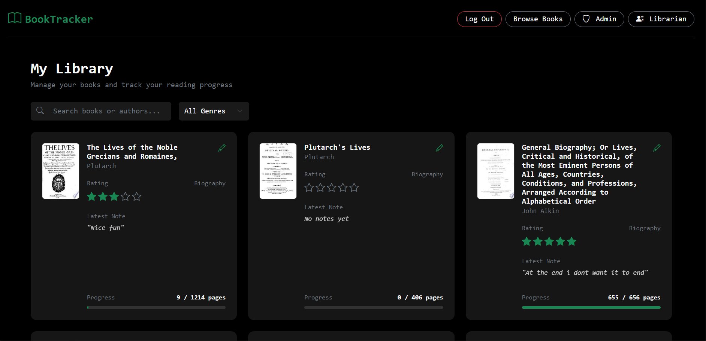
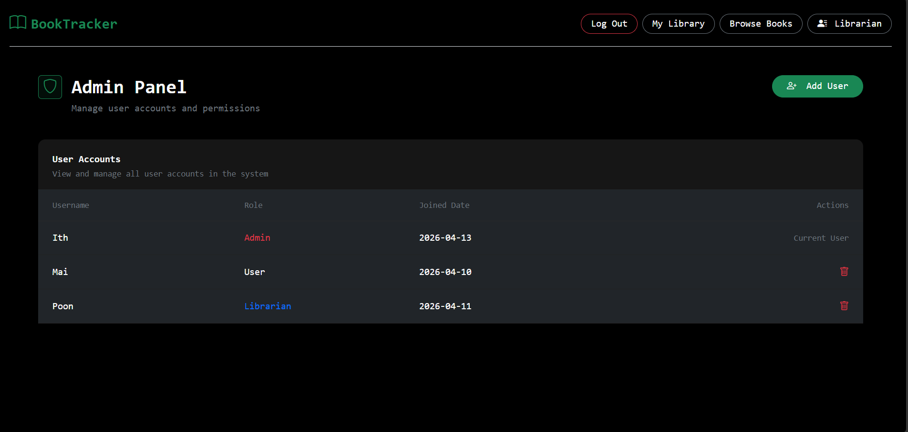
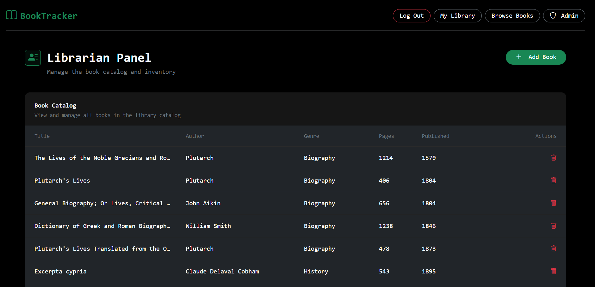
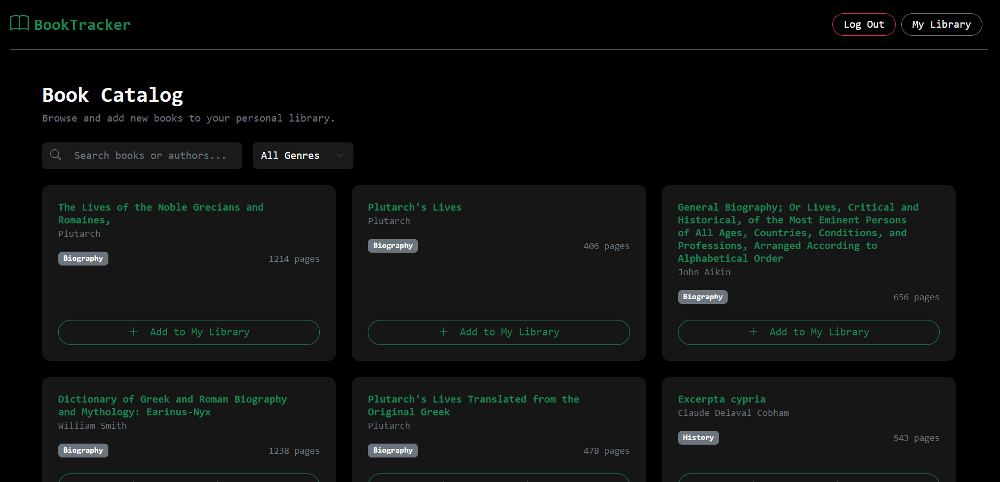

# Digital Library
Final project for Software Architecture

This project is a full-stack digital library system developed as the final project for the Software Architecture course.


---

## Project Description

The Digital Library is a web-based reading platform designed to help users organize their personal library and improve their reading experience.

The system solves the problem of users struggling to:
- track their reading progress
- manage books in one place
- discover books that match their interests

Unlike traditional book-selling platforms, this system focuses on **personal reading management**.

---

## System Architecture Overview

This project follows a **Layered Architecture** design.

The system is organized into multiple layers:

- **Presentation Layer**
  - React + Vite frontend
  - UI pages, forms, routing and navigation

- **Application Layer (API)**
  - Django REST Framework
  - authentication, API endpoints and request handling

- **Business Logic Layer**
  - role-based permissions
  - book management logic
  - reading progress processing

- **Data Access Layer**
  - Django ORM
  - database queries and model relationships

- **Database Layer**
  - SQLite
  - Django default persistent storage

Architecture flow:

Frontend → API Layer → Business Logic → ORM → Database

This architecture improves maintainability, scalability, and separation of concerns.

---

## User Roles & Permissions

### Reader (User)
Permissions:
- register and login
- browse public book catalog
- add books to personal library
- track reading progress
- manage personal reading list

### Librarian
Permissions:
- add new books
- delete books from catalog
- manage inventory records

### Admin
Permissions:
- manage all users
- remove user accounts
- monitor system access

---

## Core Features

- User registration and JWT authentication
- Browse and search book catalog
- Add books to personal library
- Track reading progress
- Role-based access control
- Librarian book management
- Admin user and role management
- Dockerized frontend and backend deployment

---

## Technology Stack

### Backend
- Django
- Django REST Framework
- SQLite
- JWT Authentication

### Frontend
- React
- Vite
- Bootstrap
- React Router

### External APIs
- Google Books API

---

## Project Structure

```text

digital-library/
├── docker-compose.yml              # Orchestrates both containers
├── README.md                       # Project documentation
├── INSTALLATION.md                 # Setup instructions
│
├── backend/                        # Django REST Framework Backend
│   ├── apps/                       # Domain logic apps
│   │   ├── book/                   # Book catalog management
│   │   ├── user/                   # Custom User roles (Librarian/Admin)
│   │   ├── reading/                # Personal library associations
│   │   └── readingprogress/        # Tracking pages, notes, and progress
│   ├── mysite/                     # Main project configuration (settings.py, urls.py)
│   ├── Dockerfile                  # Backend production environment setup
│   ├── requirements.txt            # Python dependencies (Django, JWT, CORS)
│   ├── manage.py                   # Django CLI utility
│   ├── .env                        # Local environment variables
│   └── scripts/                    # Shell scripts for container entrypoints
│
└── frontend/                       # React (Vite + React Router) Frontend
    ├── app/
    │   ├── api/
    │   │   └── auth.ts             # Central Auth Service (JWT management)
    │   ├── pages/                  # Main UI views
    │   │   ├── home/               # Landing page with feature overview
    │   │   ├── catalog/            # Public book discovery & library addition
    │   │   ├── main/               # "My Library" dashboard & progress tracking
    │   │   ├── admin/              # User/Librarian management panel
    │   │   ├── librarian/          # Book inventory management (Add/Edit/Delete)
    │   │   ├── login/              # Secure sign-in page
    │   │   └── signup/             # New user registration
    │   ├── components/             # Managed UI components (Modals, Toasts)
    │   ├── hooks/                  # Custom React hooks (useToast, etc.)
    │   ├── routes/                 # Dynamic routing definitions
    │   ├── root.tsx                # Layout wrapper & global context providers
    │   └── app.css                 # Custom CSS with design system styles
    ├── public/                     # Static assets & public resources
    ├── Dockerfile                  # Frontend build & Nginx serving setup
    ├── package.json                # NPM scripts and JS dependencies
    ├── tsconfig.json               # TypeScript configuration settings
    └── vite.config.ts              # Vite build & proxy configuration

```


## Installation & Setup Instructions

For full installation steps and how to run the system, please see [INSTALLATION.md](INSTALLATION.md)

---


## Screenshots

### Home Page


### Signup Page


### Login Page


### My Library Dashboard


### Admin Panel


### Librarian Panel


### Browse Books Page
